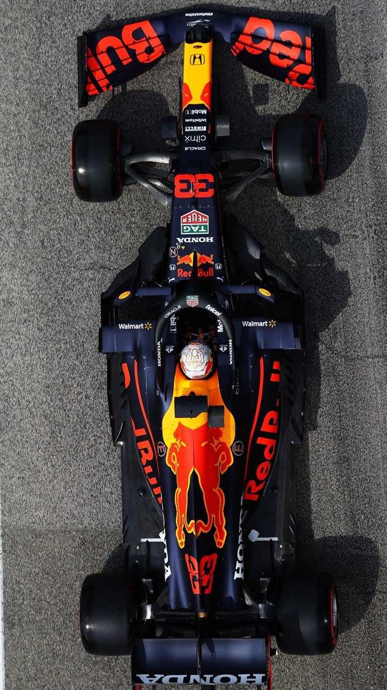
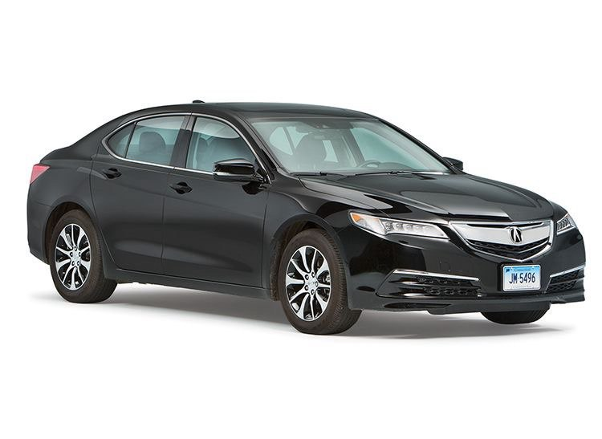
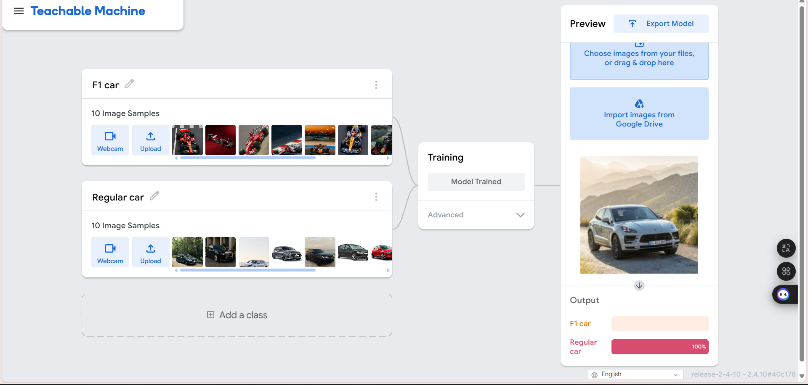
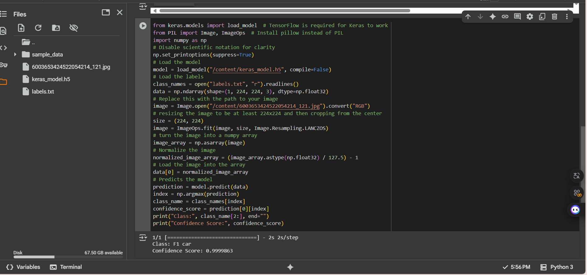

# 🏎️ Formula 1 vs Regular Car Classifier

Fast or familiar?  
This project teaches a computer how to spot the difference between high-speed Formula 1 cars and ordinary road vehicles — using just images. Trained with Google’s Teachable Machine and tested on Google Colab, the model takes a glance and makes its guess.

---

## 📷 Training Samples

| Formula 1 Car | Regular Car |
|---------------|-------------|
|  |  |

> Sample images used to train the model.

---

## 🧪 Teachable Machine Test Output

The image below shows the prediction result from **Teachable Machine** after giving it a sample image (before exporting the model):

---

## 🧪 Google Colab Test Output

After exporting the model and testing it in **Google Colab**, the following output was generated when predicting an image:

---

## 🛠️ Tools Used

- [Teachable Machine by Google](https://teachablemachine.withgoogle.com/)
- Google Colab
- Python 3
- TensorFlow / Keras

---

## 📁 Project Files

- `F1car.jpg` – Sample training image (Formula 1 car)
- `Regular_car.jpg` – Sample training image (Regular car)
- `Test1.png` – Output screenshot from Teachable Machine
- `Colab_test.png` – Output screenshot from Google Colab
- `keras_model.h5` – Trained Keras model
- `labels.txt` – Class labels
- `README.md` – Project documentation

---

## ✅ Summary

This image classifier was developed as part of a machine learning task using **Teachable Machine**. It accurately distinguishes between Formula 1 and regular cars. The model was evaluated both directly on **Teachable Machine** and externally in **Google Colab** using an exported Keras model, confirming its ability to make accurate predictions on unseen images.

